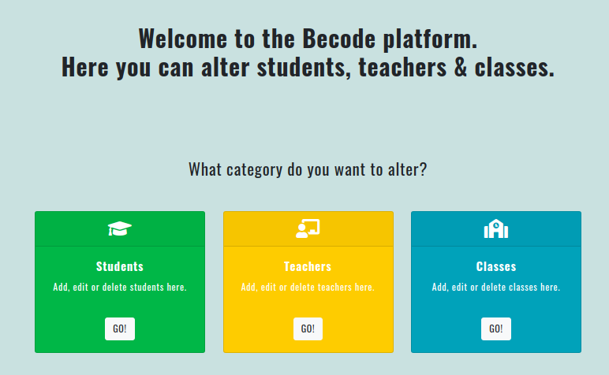
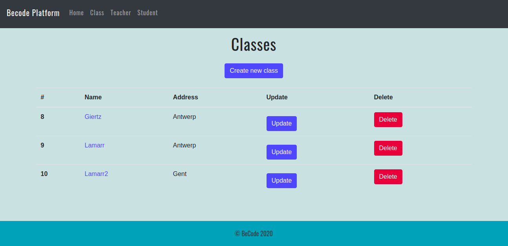

# CRUD
Create, Read, Update, Delete application 

- Repository: `php-crud`
- Type of Challenge: `Learning Challenge`
- Duration: `2 days`
- Deployment strategy : `NA`
- Team challenge : `Thi Huyen Nguyen (logic), Yoann Stas (styling) & Yuri Franken (logic)`

## Learning objectives
- To be able to connect to a database
- To be able to write a simple Create, Read, Update & Delete (CRUD) application
- Use a provided MVC structure to work into.

## The Mission
You will create a CRUD system to store student, teacher and class information in the database.
You do not need to provide any login for this script, everybody can change and view anything!

You will use the MVC structure provided in the [PHP MVC Boilerplate](https://github.com/becodeorg/php-mvc-boilerplate) repo provided by your coach, to help you on your way!

In this assigment you will end up with at least 3 models and 3 controllers, but you could end up with more. Model the software how you want it!

Our site:

### What is CRUD?
When we are building web applications, we want our models to provide four basic types of functionality. Most models will have to be able to Create, Read, Update, and Delete. This is often abbreviated as CRUD.

While is an old style of approaching applications, with new ways of thinking (Domain Driven Design, Event Driven Design) that are more flow based - CRUD is still a large portion of all the programs developed today.

### Tips
- You will see that the Teacher and Student entity are really similar - maybe you can use `Extend` here as an OOP technique?
- Create and Update are very similar in how they behave, with some smart coding techniques you could use almost the same code for both pages.

## Must-have features
You have to provide the following pages for Students, Teacher & Class.

- A general overview of all records of that entity in a table
    * Each row should have a button to edit or delete the entity
    * This page should have a "create new" button
- A detailed overview of the selected entity
    * This should include a button to delete this entity
    * Edge case: A teacher cannot be removed if he is still assigned to a class
    * Edge case: If you remove a class, make sure to remove the link between the students and the class.
- A page to edit an existing entity
- A page to create a new entity

### Fields:
On the general overview table you can yourself decide what would be useful information to show.

On the detailed overview you have to provide the following information:

#### Student
- Name
- Email
- Class (with clickable link)
- Assigned teacher (clickable link - relation via class)

#### Teacher
- Name
- Email
- List of all students currently assigned to him (clickable link)
 
#### Class 
- Name class (Giertz, Lamarr, ...)
- Location (Antwerp, Gent, Genk, Brussels, Liege)
- Assigned teacher (clickable link)
- List of assigned students (clickable link)
